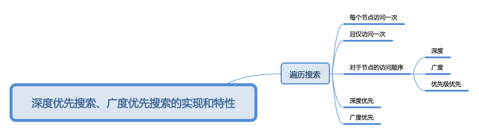
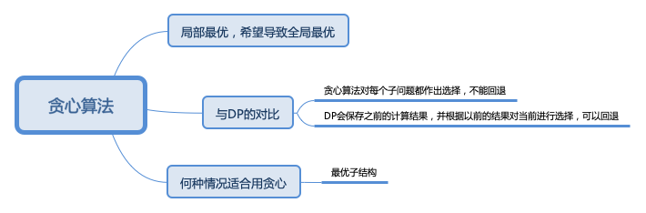
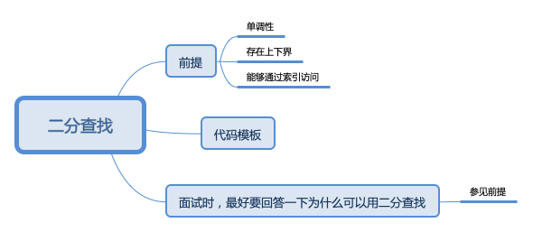

# 学习笔记

## 本周学习内容
1. 深度优先搜索、广度优先搜索
2. 贪心算法
3. 二分查找

## 本周思维内容思维导图
- 
- 
- 

## 重点内容
- 贪心算法实际使用上，可能是在某一点切入使用贪心，或者是从后往前的贪心，最普通的贪心反而较少碰到
- 贪心算法的难点往往是在于你如何证明贪心算法是最优的解法上
- 贪心与DP的主要区别在于贪心不会对做出的选择进行回溯
- 二分模板必须熟记于心
- 最朴素的二分查找，是基于单调性，有界，可下表访问三个基础来使用的，但在某些情况下，比如【搜索旋转数组】这一题，即使整个数组没有满足单调性，但是因为旋转后的数组，其实是分成了两个单调增的子数组，所以也是可以使用二分查找的，本质上，其实就是二分查找对于中值的判断，增加了判定条件

## 其他内容
- 学习方式问题：从目前来看，每周忙于赶进度刷题，可能忽视了认真的去分析每个题目的解题思路，而思路是一道题米最宝贵最精华的内容
- 已经刷了85道题，但重复刷的题不超过10题，这不符合超哥的5遍刷题法，而目前如何选择过去的题来刷，变成了一个耗时耗脑力的活动，在下一周尝试使用比如Anki/Memory Helper这一类的记忆工具来提醒我重复刷之前做过的题
- 对于精选题解/好的算法答案的收集还不够，而这主要也是因为没有对于刷过的题做总结回顾导致的，下一周需要尝试一次这样的总结，相当于是一次专题总结吧，把类似的题收集起来，把它们的精选题解也收集起来，找找规律，找找套路，看能不能形成一篇小文章输出
